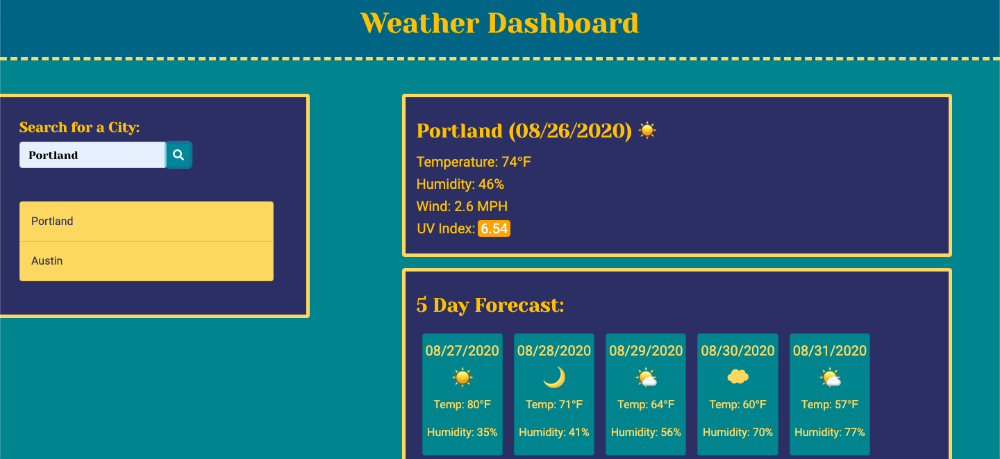

# weather-dashboard
Deployed Application: https://lilicecilia23.github.io/weather-dashboard/

This application is a weather dashboard that pulls current information from the OpenWeatherMap
API. You are able to search any city by name and receive current weather conditions in that city
as well as a 5-day forecast. When you search a city, it is saved in local storage and displayed under
the search bar. When you click the button of a past-searched city, it will re-populate the weather
information for that city. This UV index is also colored to indicate the severity of the conditions
at the time of your search (ranging from green-good to red-severe).

GitHub Repo link: https://github.com/LiliCecilia23/weather-dashboard

Technologies Used: HTML, CSS, JavaScript, jQuery, Moment.js, OpenWeatherMapAPI
